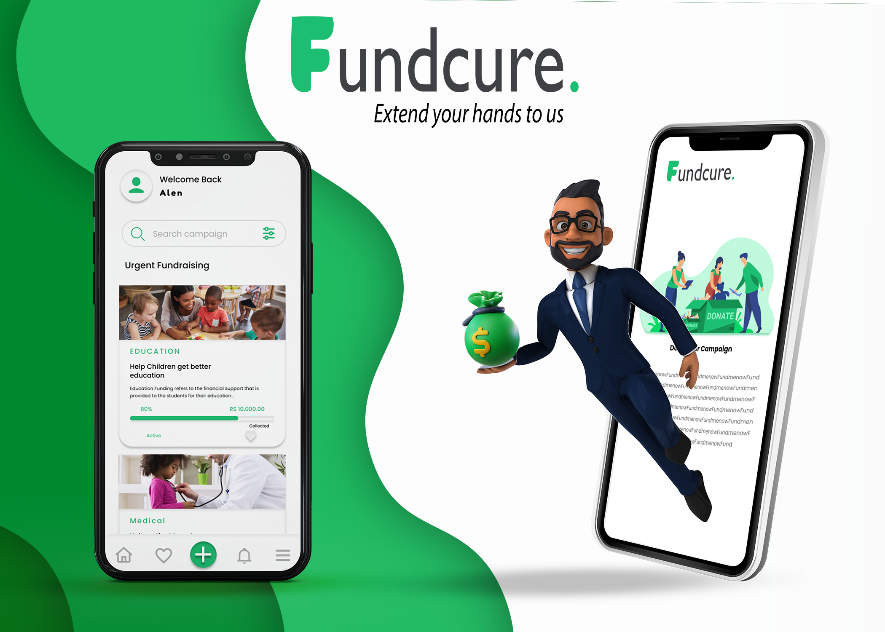

# FundCure - Fundraising Mobile Application

**FundCure** is a fundraising mobile application built using Flutter that allows users to list and support various fundraising events. Whether it's for medical treatment, educational projects, social causes, or food assistance, FundCure provides a platform for users to contribute to meaningful causes. The app includes a user-friendly interface and a chatbot for answering queries. Users can register with either their Google account or email address.

## About the Project

FundCure is designed to help people raise funds for important causes. Users can:

- Browse different fundraising events categorized into:
  - **Medical**: Events to support medical treatments and emergencies.
  - **Education**: Fundraisers for educational purposes and scholarships.
  - **Social**: Support for social welfare and community projects.
  - **Food**: Donations to provide food assistance to those in need.

Additionally, FundCure features a chatbot that provides users with instant responses to their questions and helps guide them through the app.

## Key Features

- **Multiple Event Categories**: Fundraisers are categorized into Medical, Education, Social, and Food for easy browsing.
- **Easy Registration**: Users can register using their Google account or email address.
- **Chatbot Support**: A chatbot is available to answer any questions users have about the events or the app.
- **Secure Payment Integration**: Users can donate directly to the listed events through secure payment gateways.
- **User-friendly Interface**: A simple and intuitive UI designed for easy navigation.
- **Real-time Notifications**: Users receive updates about the events they contribute to.

## UI

The app features a clean and modern UI, with separate sections for each category of events. The homepage displays a list of ongoing fundraisers, and users can easily explore different categories. 

## Figma Design Link

The design for FundCure can be viewed and explored on Figma. You can access the Figma prototype using the link below:

[Figma Design Link](https://www.figma.com/design/chqLsfyjejfwivyuD4zwHj/FundCure?node-id=0-1&t=3xlE4esnFPMqs4sL-1)

## Technologies Used

- **Flutter** for building the mobile application.
- **Firebase** for authentication and database management.
- **Chatbot API** for integrating the chatbot feature.
